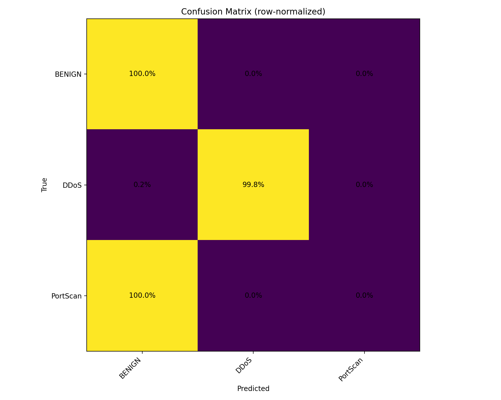

# AI-IDS
Flow-based IDS on CICIDS2017 using a multiclass RandomForest.
Reproducible training, evaluation, and a simple live-demo stub.

See README_handoff.md for a quick test checklist.

## Results (thesis run)
Accuracy: **0.9848** · Macro-F1: **0.8141** · Weighted-F1: **0.9863**  
Confusion matrices and full report are in `reports/`.

## Confusion matrix (row-normalized)

## Confusion matrix (row-normalized)

